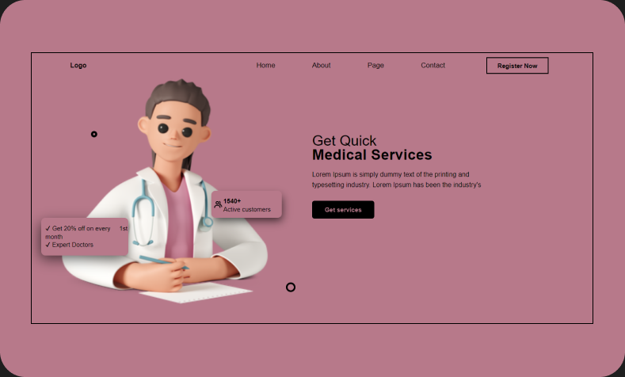

# Reactjs 👀
## Getting Started with Create React App

This project was bootstrapped with [Create React App](https://github.com/facebook/create-react-app).

### `npm start`

Runs the app in the development mode.\
Open [http://localhost:3000](http://localhost:3000) to view it in your browser.

The page will reload when you make changes.\
You may also see any lint errors in the console.

## Snap  🤖

    
## 🚀 About Me
I'm a Front-end developer using Reactjs... ✔

## 🔗 Links

 

